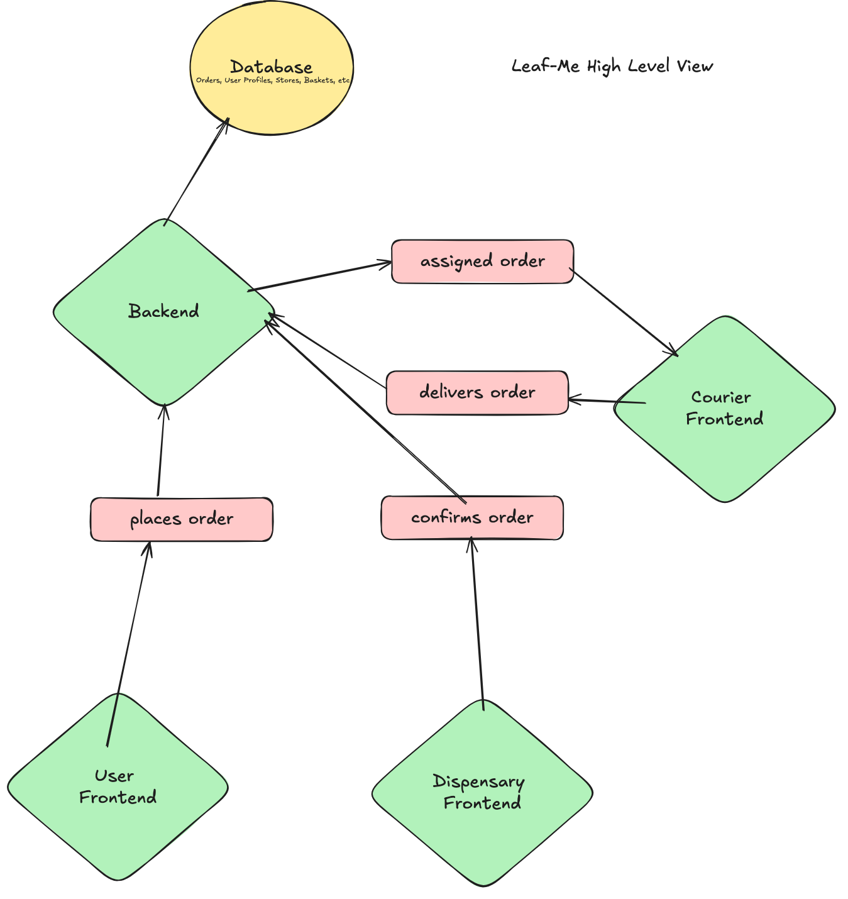

# leaf-Me Weed Delivery App



Leaf-Me is a full-stack Uber Eats-style delivery platform designed for dispensaries. The app streamlines the process of placing, preparing, and delivering orders through multiple role-based interfaces:

- Client/User Frontend (Mobile): Enables users to browse dispensaries, place orders, and track deliveries.
- Restaurant Frontend: Allows dispensaries to manage incoming orders, confirm preparation, and notify couriers when orders are ready.
- Courier Frontend: Provides delivery drivers with access to available orders and delivery details.

## Current State

### Backend
The backend is deployed and fully functional with Docker. It supports user authentication, allowing users to sign in and out successfully.

- User Management: Users can register, log in, and manage their accounts.
- Order Processing: The backend can handle order creation and retrieval, ready for integration with the frontends.

### Mobile Client/User App

Near completion with just a few pages remaining. At it current state it supports full userflow through the application
Features include:

- Browsing Dispensaries: View and filter available dispensaries and their products.
- User Authentication: Register, log in, and manage user profiles.
- Adding Items to a Cart: Select and add products to the cart.
- Specifying Item Quantities: Adjust quantities for each item in the cart.

## Next Steps:

Shift focus to developing the Restaurant Frontend for dispensaries to manage and fulfill orders.

## Installation

1. Clone the repository:
   ```
   git clone https://github.com/your-username/leaf-me-backend.git
   ```

2. Install dependencies:
   ```
   npm install
   ```

3. Set up the environment variables:
   Create a `.env` file in the root directory and add the following:
   ```
   PORT=3001
   PG_HOST=localhost
   PG_PORT=5432
   PG_DATABASE=leafme_db
   PG_USER=your_postgres_username
   PG_PASSWORD=your_postgres_password
   SECRET_TOKEN=your_secret_token
   ```

4. Initialize the database:
   ```
   npm run dbinit
   ```

5. Seed the database:
   ```
   npm run dbseed
   ```

## Usage

To start the server using Docker:

```
docker run -d --name leafme-backend-container -p 3001:3000 your-dockerhub-username/leafme-backend:latest
```

## Deployment

The backend is automatically deployed to an EC2 instance using GitHub Actions when changes are pushed to the main branch. The deployment process includes:

1. Building a Docker image
2. Pushing the image to Docker Hub
3. Pulling the latest image on the EC2 instance
4. Starting a new container with the updated image

Ensure that all necessary secrets (EC2_SSH_PRIVATE_KEY, EC2_HOST, EC2_USER, DOCKERHUB_USER) are set in the GitHub repository settings.

## API Documentation

For detailed information about the API endpoints and their usage, please refer to the README file located in the backend folder of this repository.
